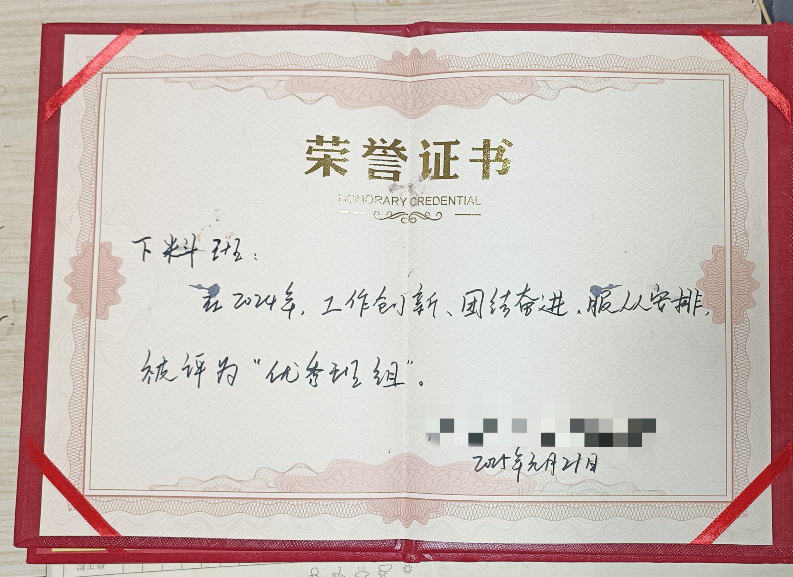
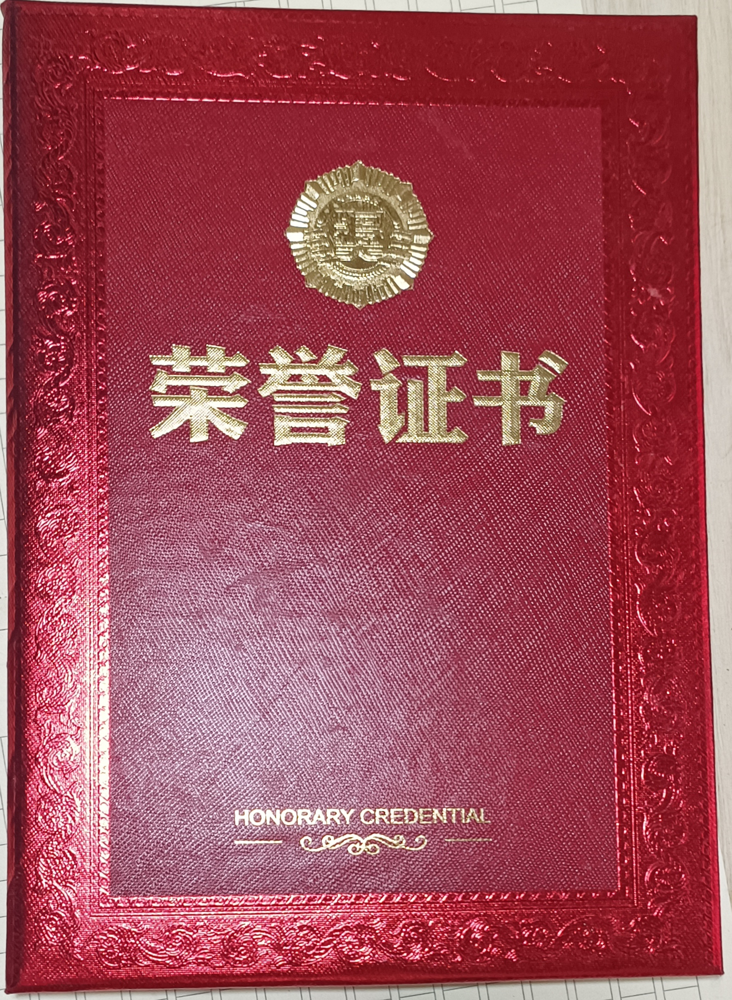
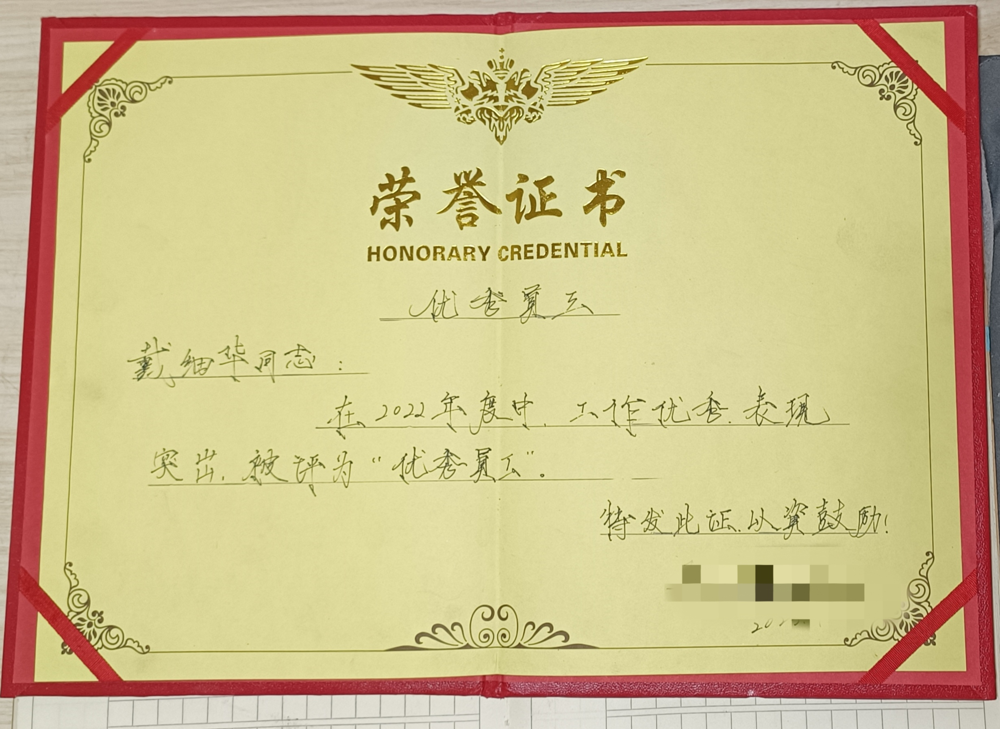
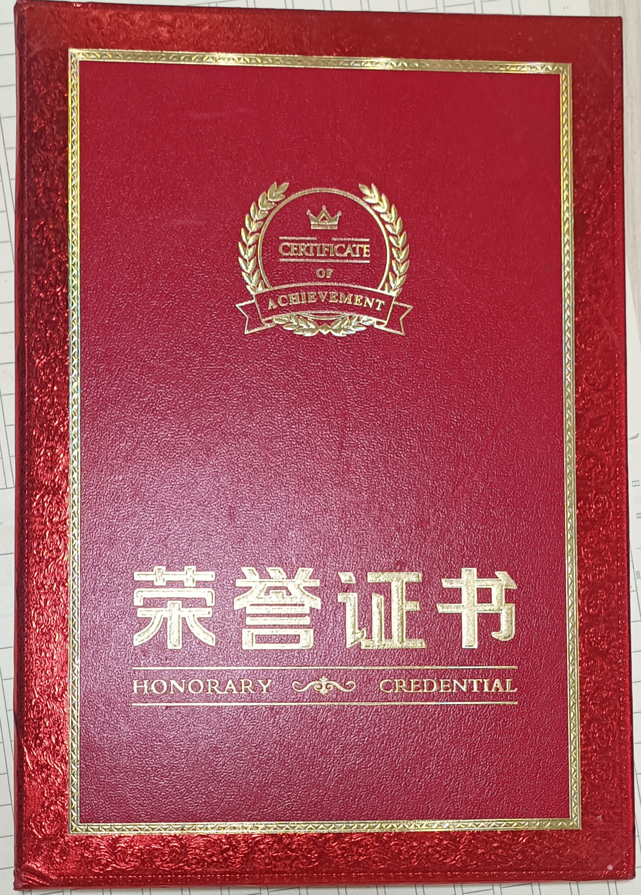

# 戴工 | 激光切割技术成长记录

&gt; 不是专家，是日记。  
&gt; 一个激光切割操作工，从手动拆图到写自动化工具的过程记录。

---

## 阶段记录

| 阶段 | 时间 | 状态 |
|------|------|------|
| 纯操作，记参数 | 201X-2020 | 已完成 |
| Excel+VBA小工具 | 2021-2023 | 已完成 |
| Python DXF处理，系统破解 | 2024-至今 | 进行中 |

---

## 最近更新

- 2026-06-28：低压电工证培训完成，建立个人技术主页
- 2026-06-XX：DXF拆分器增加同名零件递增编号
- 2026-06-XX：宏山.ncex文件校验和逻辑修正

---

## 知识库（随时往里塞）

- [激光切割工艺记录](./laser-knowledge/)（待建）
- [SolidWorks二次开发笔记](./sw-dev/)（待建）
- [Python工具链](./python-tools/)（待建）

---
## 资质与荣誉

---

## 联系

- 邮箱：daimaker@163.com
