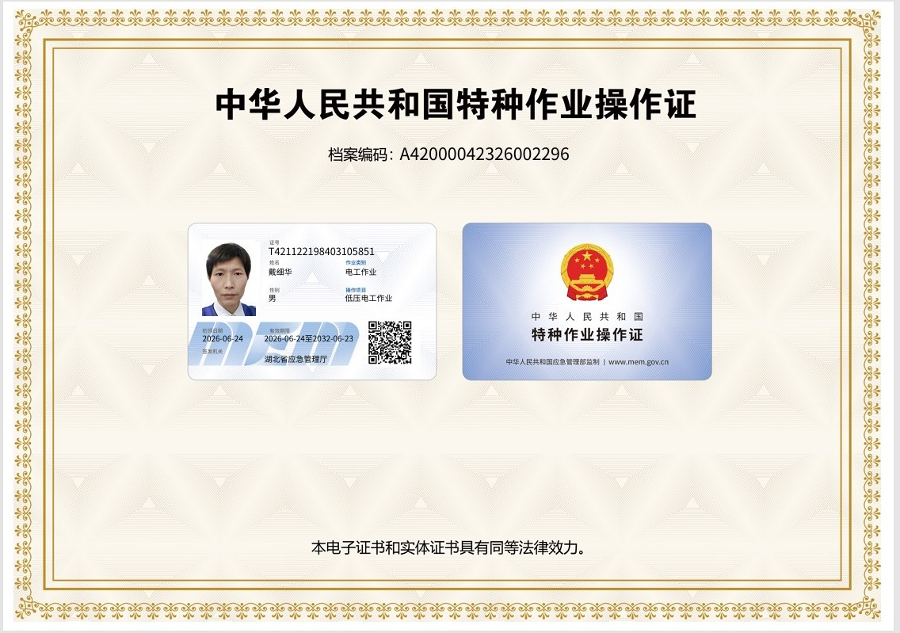
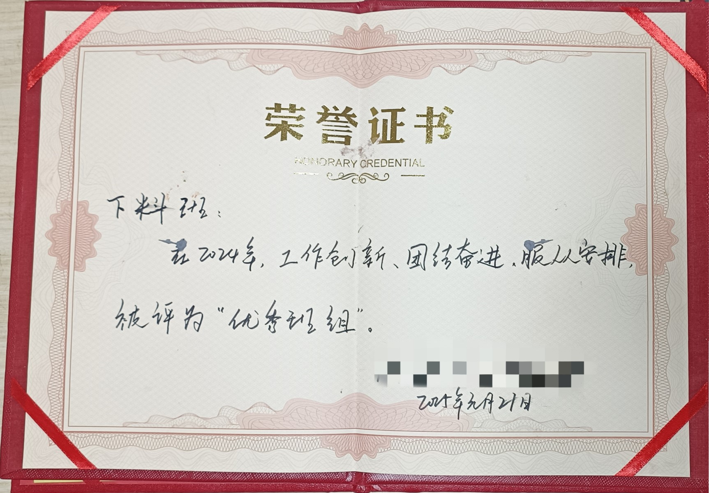
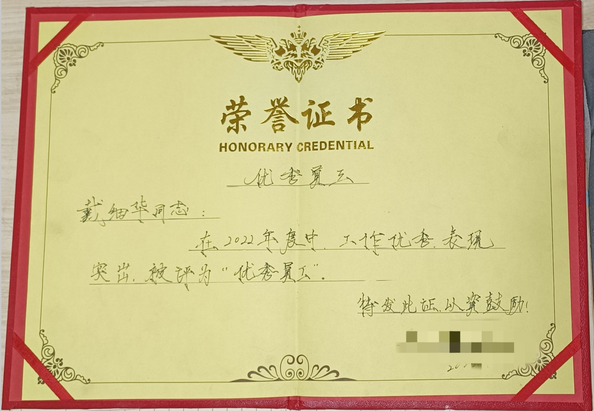

  
  📱 扫码进入

<h1 align="center">戴工 | 激光切割技术成长记录</h1>

<i><b>激光切割智能自动化工程师。</b>将知识沉淀为可复用系统，以代码输出反哺现场设备，智能自动化闭环改造历程。</i>

---

## 当前攻坚

- [逆向解析](./projects/reverse-parsing/) — 专有格式语义还原与结构解构
- [领域建模](./projects/domain-modeling/) — 工艺知识数据化抽象与参数体系构建
- [格式转换](./projects/format-transform/) — 异构数据标准化映射与序列化
- [封装输出](./projects/re-encapsulation/) — 通用接口标准化封装与系统对接

---

## 知识库（随时往里塞）

- [激光切割痛点故障分析](./laser-knowledge/)（待建）
- [小妙招](./tips/)（待建）
- [软件小工具下载](./tools/)（待建）

---

## 资质与荣誉

  <table style="border: none;">
    <tr>
      <td></td>
      <td></td>
      <td></td>
    </tr>
  </table>

---
## 联系

- 📧 邮箱：daimaker@163.com
- 🔧 技术方向：激光切割自动化 / Python DXF处理 / SolidWorks二次开发
