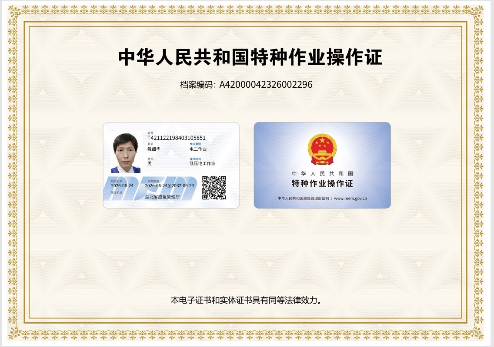
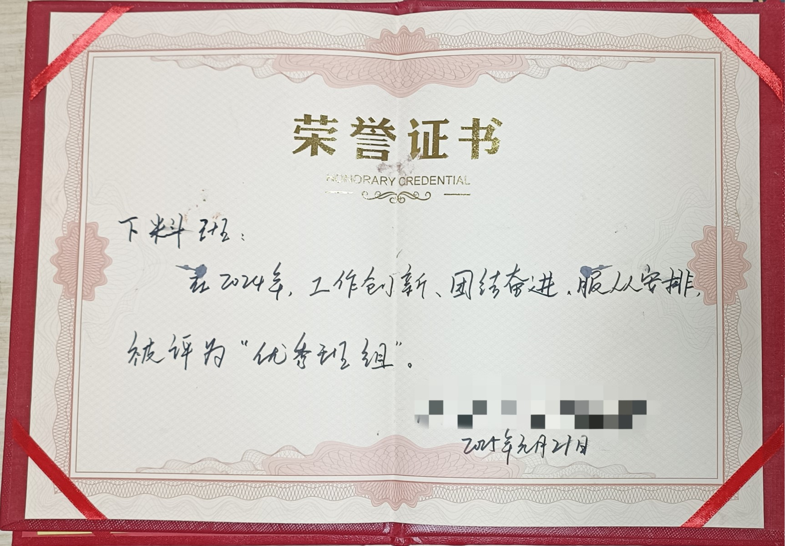
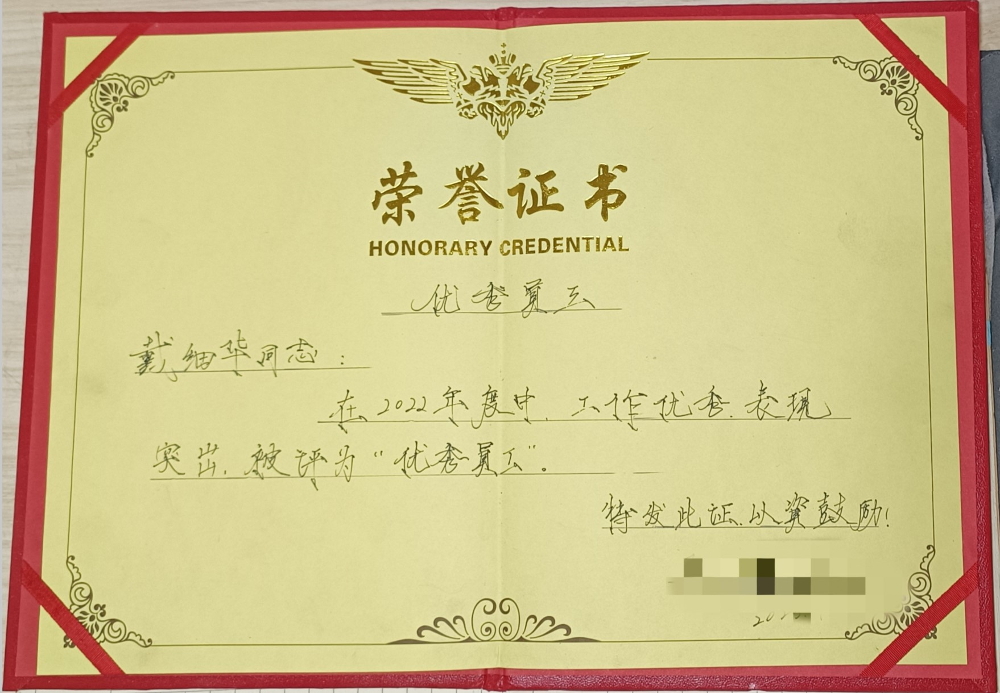
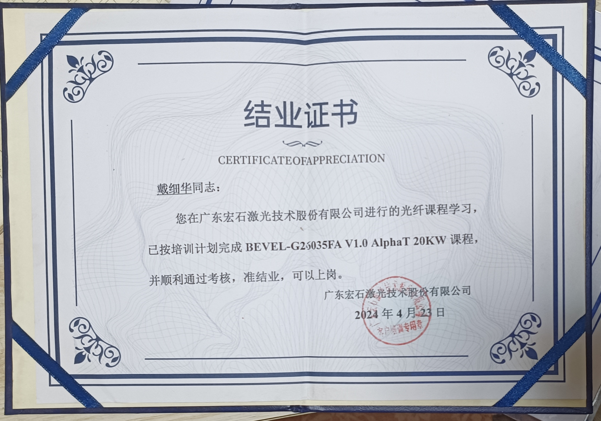
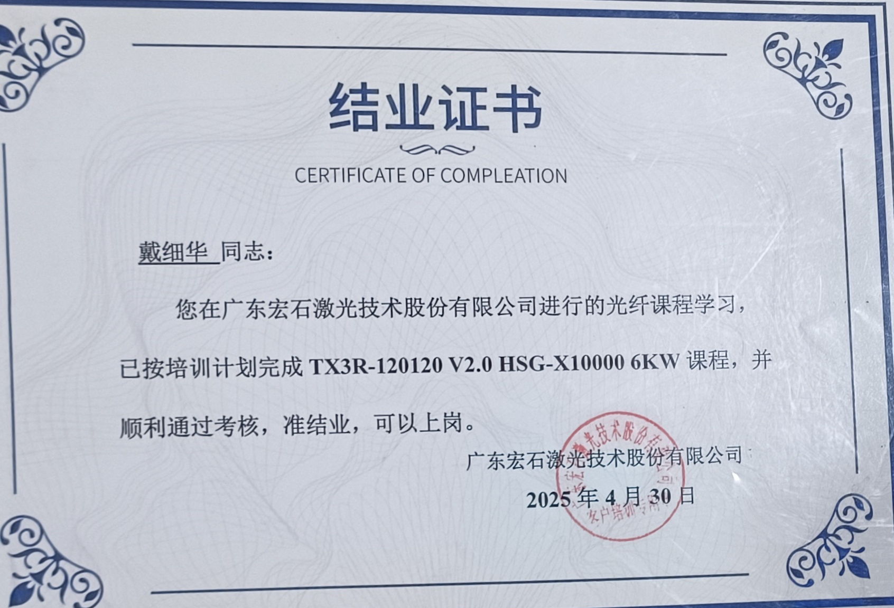

# 戴工 | 激光切割技术成长记录

> 激光切割智能自动化工程师。将知识沉淀为可复用系统，以代码输出反哺现场设备，智能自动化闭环改造历程。

 📱 扫码进入

---

## 进行中的项目

- **WIP 工序交接系统** — 钢模厂跨班次交接跟单，替代人工跟单、客户进度查询（开发中）
- **Arduino 现场试验台** — 设备外围自动化改造验证，建立按钮/限位/传感器完整真值表（搭建中）

---

## 已完成的项目与笔记

### 效率工具
- [DXF 图纸拆分器](projects/dxf-processor/) — 自动拆分总装图、标注十字标，100零件 40min→2min
- [图纸批量缩放](tools/batch-scaler/) — 外协图纸比例统一，批量处理保留图层
- [NCEX 参数修改工具](tools/ncex-param-tool/) — 换材料批量改50个工艺文件，2h→3min，自动备份留痕
- [柏楚日志解析](tools/log-parser/) — 报警后自动提取关键事件，故障排查 1h→5min

### 故障排查与诊断
- [日志解析实战](tips/fault-diagnosis/log-analysis.md) — 从柏楚日志发现周期性参数漂移

### 系统配置与联调
- [PLC 通用语言专业英文名词](tips/efficiency/plc-terms.md)
- [宿主虚拟工控联调](tips/system-setup/virtual-plc.md)
- [远程桌面自动化](tips/system-setup/remote-desktop.md)
- [一机多屏架构](tips/system-setup/multi-screen.md)

### 硬件改造与底层
- [模拟量与数字量](tips/hardware/analog-digital.md)
- [PWM 深度解析](tips/hardware/pwm.md)
- [开关量真值表](tips/hardware/switch-logic.md)
- [编码器与磁电](tips/hardware/encoder.md)
- [单片机与二进制](tips/hardware/mcu-binary.md)

---

## 资质与荣誉

| 低压电工证 | 优秀班组 | 优秀员工 | 坡口板材激光操作证 | 三卡型材激光操作证 |
|:----------:|:--------:|:--------:|:------------------:|:------------------:|
|  |  |  |  |  |

---

## 联系

- 📧 邮箱：daimaker@163.com
- 🖊 技术方向：激光切割自动化 / Python DXF处理 / SolidWorks二次开发
- GitHub: [@daigong26](https://github.com/daigong26)
